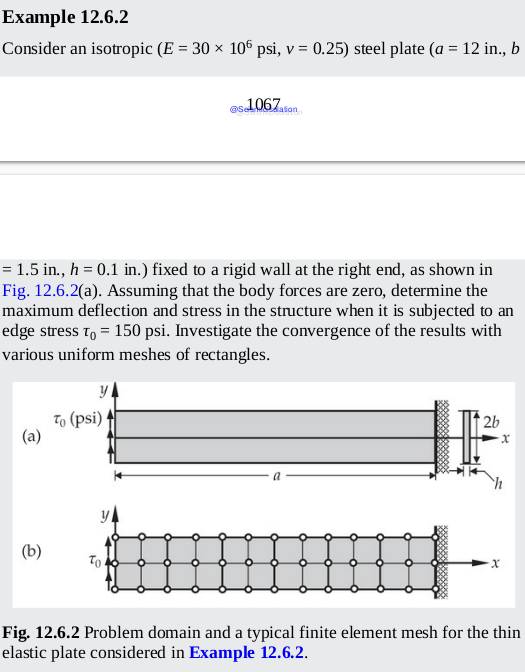
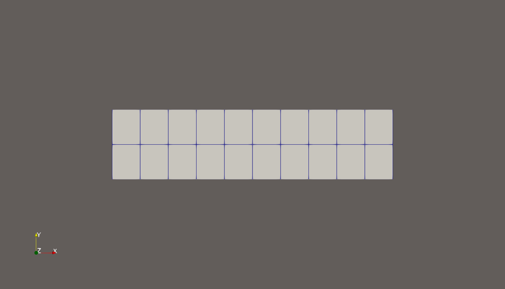
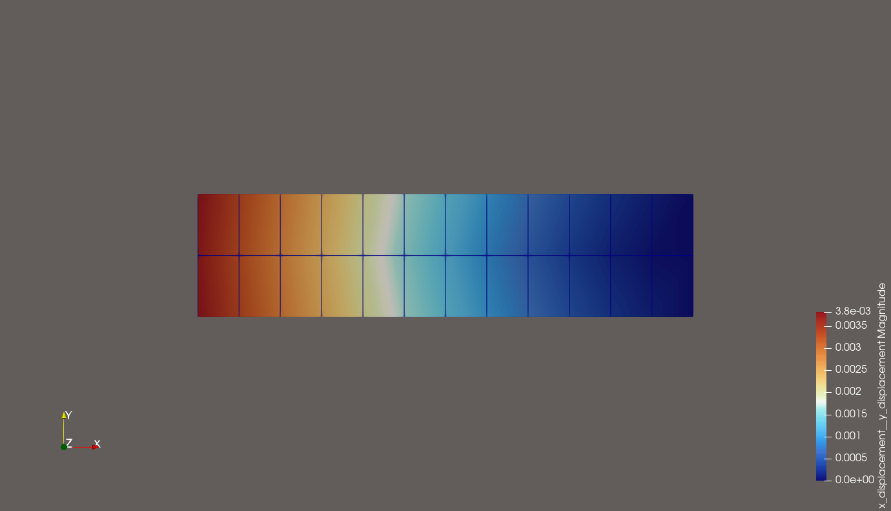
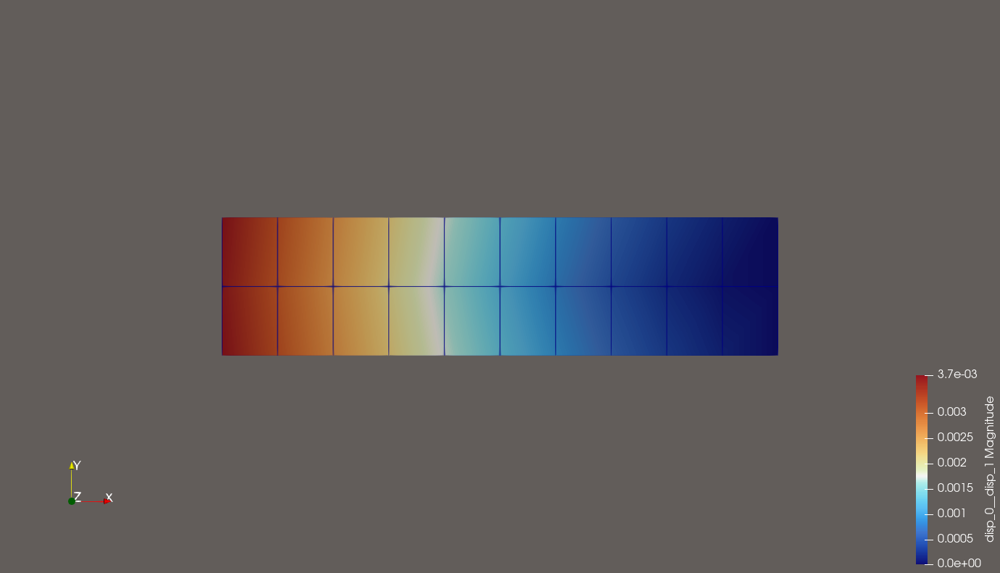
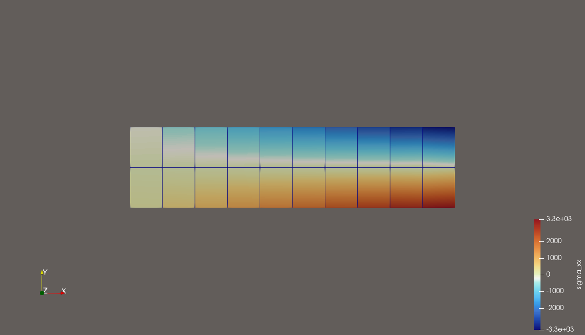
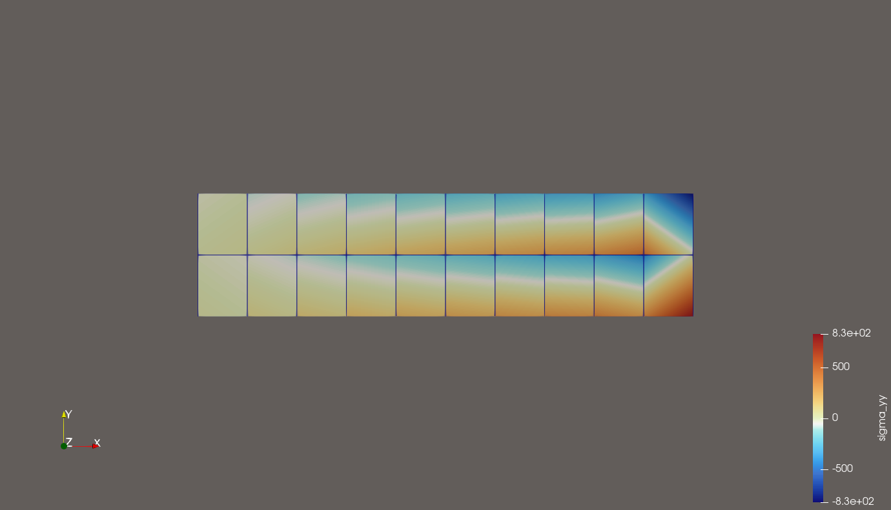
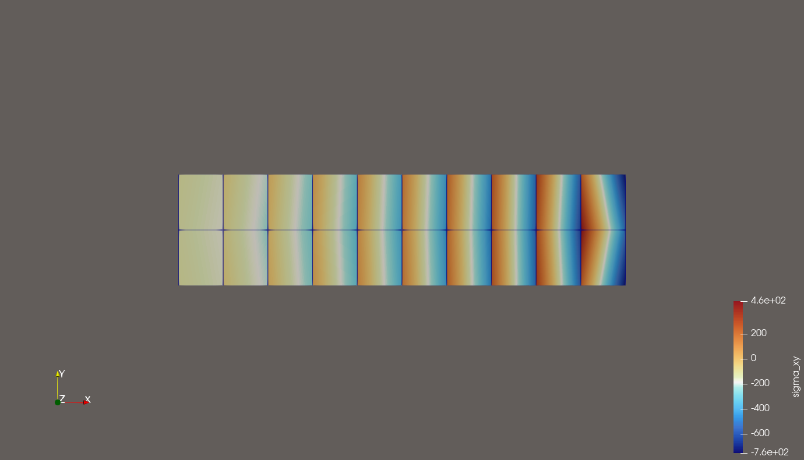

# Finite Element Analysis of a Steel Plate under Edge Stress

This repository implements a finite element solution for **Example 12.6.2**. It studies deformation and stress distribution of a thin isotropic steel plate subjected to uniform edge shear stress using the **deal.II** library (C++).

---

## Problem Description

- **Material**
  - Elastic modulus: `E = 30 × 10^6 psi`
  - Poisson's ratio: `ν = 0.25`
- **Geometry**
  - Length: `a = 12 in`
  - Half-width: `b = 1.5 in`
  - Thickness: `h = 0.1 in`
- **Boundary Conditions**
  - Right end fixed to a rigid wall
  - Left edge: uniform shear stress `τ₀ = 150 psi`
- **Assumptions**
  - No body forces
  - Plane-stress formulation
- **Objectives**
  1. Determine maximum deflection
  2. Compute stress distribution
  3. Study convergence with uniform rectangular meshes

---

## Methodology

1. **Finite Element Method (FEM)**
   - 2D rectangular elements (plane stress)
   - Quadrature and element-level assembly
   - Mesh refinement studies for convergence
2. **Implementation**
   - Language: **C++**
   - Primary library: **deal.II**
   - Typical steps: mesh generation → DoF setup → assembly → apply BCs → solve → post-process
3. **Post-processing**
   - Extract maximum displacement and stress fields
   - Export VTK/VTU files for visualization (ParaView)

---

## Expected Results

# Plate Under Shear (deal.II Trial Project)

## 📖 Problem Statement
The FEM problem solved here:

---

## 🖥️ Mesh Generated

---

## 📊 Results

- Overall deformation:  
  

- Overall stress distribution:  
  

- Stress component σxx:  
  

- Stress component σyy:  
  

- Stress component σxy:  
  

---

